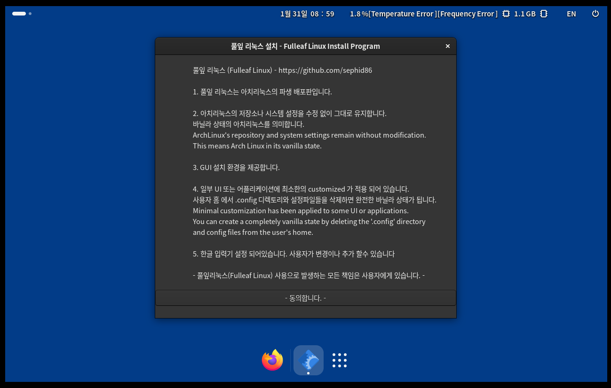

 

풀잎 리눅스 설치 ISO 파일 다운로드  (Download Fulleaf Linux Installation ISO File)  
--
**[풀잎 리눅스 설치 ISO 파일 다운로드 (Download Fulleaf Linux Installation ISO File)](https://drive.google.com/file/d/1UYnub7zI72s1846a0JYXpdvHkGCIZzj3/view?usp=drive_link)**
 
https://drive.google.com/file/d/1UYnub7zI72s1846a0JYXpdvHkGCIZzj3/view?usp=drive_link
 
- 최근 업데이트 2025년 12월 19일  

풀잎 리눅스 (Fulleaf Linux - Arch Linux derivative)  
--
- Automated Korean input is enabled.
- Added useful customizations for a few other apps.
- The widgets in the screenshot are available by installing eww from the AUR.
- 한글 입력이 자동으로 설정되어 있습니다.
- 몇몇 앱들에 사용하기 편리한 커스텀이 설정되어 있습니다.
- 스크린샷에 보이는 위젯은 aur 에서 eww 를 설치하시면 적용됩니다.  
---
I also develop small utilities and occasionally contribute to other projects.  
또한, 소소한 유틸리티들을 개발하며 드물게 가끔 다른 오픈소스 프로젝트에도 아주 작지만 기여를 하고 있습니다.  
  
I'm working towards becoming Cup Noodles Profitable.  
이 개발자는 오늘 굶었을지도 모릅니다.  

 

---

풀잎 리눅스를 가상머신에 설치하는 경우 (Run on virtual machine)
--
You must enable EFI/UEFI in your virtual machine settings to install Fulleaf Linux. 
가상머신을 efi 로 설정 해줘야 합니다. 
 
 
엔비디아 GPU (Nvidia GPU)
--
엔비디아 장치가 없어서 테스트 해보지 못했습니다. 
정상적인 동작을 보장하지 못합니다.
Due to the lack of an Nvidia device, this has not been tested. 
Proper operation cannot be guaranteed.
